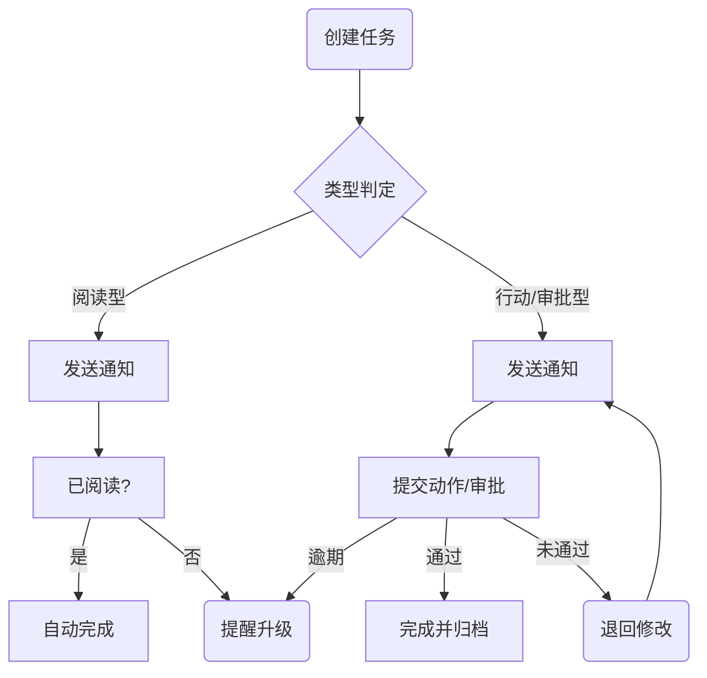

# 华中科技大学机械学院 选课系统设计（中英文）

## 1. 系统目标
- 为领导、科研秘书、授课教授、学生四类用户提供统一入口
- 让"选什么课、选到了吗"全过程数字化、自动化、可追踪
- 通过数据追踪与社交网络功能支撑下一年度课程规划与团队协作

## 2. 登录与角色识别
1. 访问 `/login`
2. 输入学/工号 + 密码 → 生成 JWT Token
3. Token 内含 role 字段，前端按角色加载对应工作台

## 3. 公共区（所有角色共有）

| 功能区 | 作用 | 典型内容 | 设计理由 |
|--------|------|----------|----------|
| **Profile** | 个人页 | 头像、姓名、院系、研究/兴趣标签、技能、联系方式、可见性设置 | 统一"名片"，也是社交网络节点 |
| **Setting** | 个性化与安全 | 修改密码、多因素认证、消息开关、隐私级别 | 用户自主管理 + 安全 |
| **Dashboard** | 待办 + 关键数据 | 选课日历、提醒卡片、统计图、社交动态 | 行动入口集中，降低跳转 |

## 4. 四类角色顶层活动

| 角色 | 核心职责 | 典型动作 | 交互对象 |
|------|----------|----------|----------|
| **领导** | 战略 + 监督 | 审批课程、下达任务、查看统计、年度复盘 | 秘书、教授 |
| **科研秘书** | 运营 + 协调 | 发布选课日程、运行匹配、催办任务、生成报告 | 领导、教授、学生 |
| **授课教授** | 教学 + 招募 | 部署课程、审核志愿、发布研究动态 | 秘书、学生 |
| **学生** | 学习 + 组队 | 浏览课程、提交志愿、组队协作 | 教授、学生 |

**任务-消息中心（Task & Message Center）**：四类角色共用的站内 IM + 任务流组件（见第 12 章），统一承载"阅读型任务"与"行动型任务"。

## 5. 顶层选课流程
创建 → 审批 → 公布 → 志愿 → 匹配 → 教授确认 → 结果公示 → 数据归档

## 6. Dashboard 设计（含社交/数据卡片）

| 角色 | 关键卡片 | 即时指标 | 社交动态 | 待办提醒 |
|------|----------|----------|----------|----------|
| 领导 | 年度课程热度排行 | 选课人数、满额率 | 课程评价词云 | 待审批课程 |
| 秘书 | 匹配进度仪表 | 已匹配%、冲突数 | 未部署课程教师列表 | 未选课学生名单 |
| 教授 | 我的课程卡 | 报名数、剩余名额 | 新关注学生、组队请求 | 未确认学生、部署倒计时 |
| 学生 | 我的志愿卡 | 志愿列表、成功概率 | 推荐队友、导师新动态 | 志愿截止倒计时、结果确认 |

## 7. 提醒系统（核心矩阵）

| 角色 | 关键提醒 | 常规提醒 | 体验型提醒 |
|------|----------|----------|------------|
| 秘书 | 未部署课程教授 未选课学生 | 流程启动倒计时 | 容量不足扩容建议 |
| 教授 | 课程部署截止 未确认志愿 | 报名满额提示 | 同领域课程竞争分析 |
| 学生 | 志愿截止 结果确认截止 | 志愿冲突提示 | 名额空出即时通知 |
| 领导 | 课程审批待办 公平性异常 | 利用率阈值提醒 | AI 预测热门方向 |

## 8. 数据追踪 → 年度课程复盘
报名-容量、弃选率、课程评分、完成率、师资负荷等数据自动汇聚生成"年度课程白皮书"，领导可一键下载，用于下一年度决策。

## 9. 社交网络功能
Profile 节点 + 关注 / 组队 / 共同课程三类关系，支持学生-学生、教授-学生、领导-教授信息视图。

## 10. Profile 与 Dashboard 信息结构
详见上一版表格。

## 11. 实施节奏建议
Sprint 1 到 5 渐进式交付。

## 12. 站内任务-消息流（新增）

### 12.1 任务类型

| 类型 | 完成判定 | 典型示例 |
|------|----------|----------|
| **阅读型** | 接收方点击「已阅读」即可完成 | 领导下发"本周教改政策"给秘书 / 教授 |
| **行动型** | 接收方提交动作或文件，系统校验通过 | 秘书要求教授**在 8-31 前上传课程大纲** |
| **审批型** | 接收方点击同意/拒绝并附理由 | 教授审批学生转入申请 |

### 12.2 角色互发任务场景

| 发起方 → 接收方 | 任务示例（阅读型 / 行动型） | 系统自动支持 |
|-----------------|------------------------------|--------------|
| **领导 → 秘书** | • 阅读型：下学期培养方案讨论纪要 • 行动型：**9-10 前**提交《课程容量调整报告》 | *阅读后隐藏* / *提交后自动归档* |
| **秘书 → 教授** | • 阅读型：最新教材选用指导 • 行动型：**8-25 前**完成课程部署（课次、阅读资料、作业） | 逾期系统升级提醒 |
| **教授 → 学生** | • 行动型：**9-15 前**完成志愿填报反馈问卷 | 智能检测提交完整性 |
| **学生 → 教授/秘书** | • 行动型：申请课程变更 / 请假 | 流程自动生成审批单 |

### 12.3 任务生命周期

### 12.4 数据字段（Task Entity）

| 字段 | 说明 | 示例 |
|------|------|------|
| task_id | 主键 | T-2025-0001 |
| title | 任务标题 | 「上传实验课大纲」 |
| description | 任务说明 | 包含课次表、阅读资料 PDF |
| type | read / action / approval | action |
| sender_id / receiver_id | 角色 ID | leader-01 → secretary-02 |
| deadline | 截止时间 | 2025-08-25 23:59 |
| status | pending / read / done / overdue | pending |
| related_course | 关联课程 ID | C-LAB-001 |

### 12.5 Dashboard 任务卡片

| 角色 | 任务卡片字段 | 自动排序 |
|------|-------------|----------|
| 领导 | 待办任务数 + 逾期率 + 秘书完成度 | 截止时间最近优先 |
| 秘书 | 待办任务数 + 逾期教师名单 | 逾期优先 |
| 教授 | 我的任务 + 未读政策 | 截止时间优先 |
| 学生 | 我的任务 + 待审批申请 | 截止时间优先 |

## 13. 本科生课程培养体系设计优化（领导视角扩展）

### 13.1 核心目标
- **OBE（Outcome-Based Education）**：课程学习产出与毕业要求对齐
- **循环改进**：用选课-评价-数据追踪三环路，年度滚动更新课程库

### 13.2 新增功能模块

| 模块 | 作用 | 关键界面 | 数据来源 |
|------|------|----------|----------|
| **Curriculum Map** | 映射毕业能力 → 课程 | 能力矩阵、课程-能力热图 | 课程大纲、评价指标 |
| **Course Proposal Workflow** | 新课立项-审批-上线 | 立项表、风险评估、专家评审 | 教授提交、数据追踪 |
| **Annual Review** | 本年度课程效果复盘 | 课程得分雷达图、弃选热力图 | 选课数据、问卷、成绩 |
| **Gap Analysis** | 检测培养体系漏洞 | 能力缺口报告、AI 补充建议 | Curriculum Map + Annual Review |

### 13.3 领导年度工作清单（任务化）

| 时点 | 任务 | 类型 | 下发对象 | 自动数据支持 |
|------|------|------|----------|-------------|
| 3月 | 生成「课程修订指南草稿」 | 阅读型 | 秘书、教授 | 去年白皮书 |
| 4月 | 收集新课立项申请 | 行动型 | 教授 | Proposal Workflow |
| 6月 | 审批课程库调整 | 审批型 | 秘书 | Gap Analysis 报告 |
| 10月 | 启动教学质量问卷 | 行动型 | 学生 | 问卷自动推送 |
| 12月 | 发布年度白皮书 | 阅读型 | 全体 | 统计模块自动生成 |

### 13.4 培养体系指标库（示例）

| 能力大类 | 二级指标 | 评价数据源 | 最低达成度 |
|----------|----------|------------|-----------|
| 科学思维 | 实验设计、数据分析 | 课程测验、实验报告 | 75% |
| 工程实践 | 工程软件使用 | 项目作业 | 70% |
| 创新能力 | 创新项目、竞赛获奖 | 创新实践学分 | 60% |
| 国际视野 | 英文文献阅读 | IELTS/TOEFL | 80% |
| 团队协作 | 组队项目互评 | 组队作业 | 85% |

系统可实时汇总「指标达成度」→ 领导 Dashboard 出现红黄绿灯；红灯项自动生成改进任务发给秘书 / 教授。

### 13.5 与现有流程的融合
- **Proposal Workflow** 与「任务-消息流」打通，立项表一键转 Action-Task。
- **Annual Review** 结果注入「提醒系统」，生成下一学年早期提醒。
- **Curriculum Map** 直接嵌入领导 Dashboard，可钻取到课程-指标-学生表现。

---

通过 **第 12 章的站内任务-消息流**，四类角色能够 **精准下发、跟踪并完成** 选课相关任务；而 **第 13 章的本科生培养体系模块** 让领导可基于实时数据 **设计、评估并持续改进** 整个课程体系。两者与原有提醒系统、数据追踪与社交网络功能 **无缝衔接**，共同构成一个从宏观战略到微观执行都闭环的选课与教学管理平台。